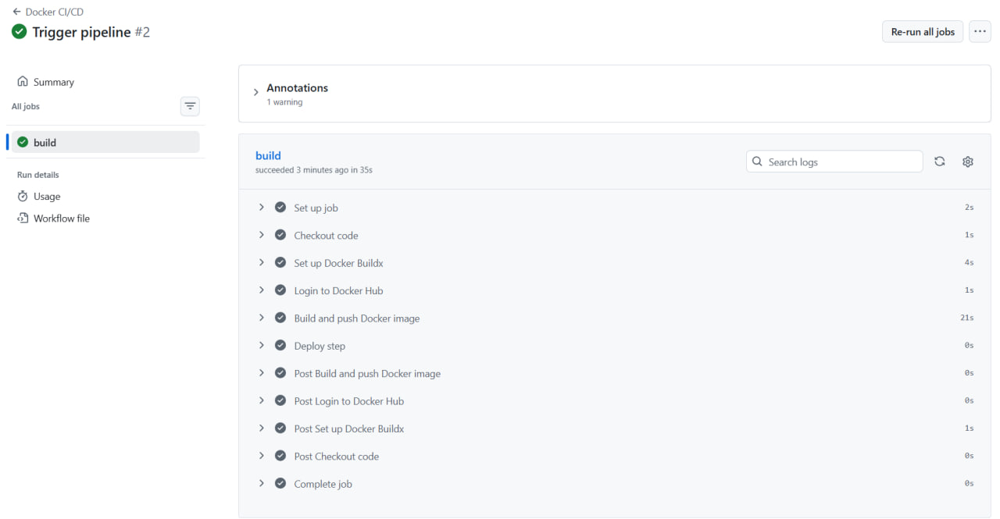

University: [ITMO University](https://itmo.ru/ru/)\
Faculty: [FICT](https://fict.itmo.ru)\
Course: [Введение в веб технологии](https://itmo-ict-faculty.github.io/introduction-in-web-tech/)\
Year: 2025/2026\
Group: U4125\
Author: Eliseeva Polina Fedorovna\
Lab: Lab2\
Date of create: 15.03.2026 \
Date of finished: 15.03.2026

# Лабораторная работа №2
## Настройка CI/CD с использованием GitHub Actions

## Цель работы

Изучить основы автоматизации сборки и публикации Docker-образов с использованием CI/CD. Настроить pipeline GitHub Actions, который автоматически собирает Docker-образ приложения и публикует его в Docker Hub при каждом push в репозиторий.

## Ход работы

Подготовка проекта
1. Создала новый репозиторий и файлы app.py, requirements.txt, Dockerfile

2. Создала новый репозиторий на Docker Hub для хранения образа

Настройка GitHub Actions:

3. Создала папку .github/workflows/ в корне проекта

4. Создала файл docker-build.yml с пайплайном, который должен:

Запускаться при пуше в main ветку

Использовать Ubuntu как runner

Выполнять checkout кода

Настраивать Docker Buildx

Логиниться в Docker Hub используя секреты

Собирать и пушить образ с тегом username/my-flask-app:latest

Добавлять шаг деплоя (можно просто echo сообщение)

Сделала пуш и коммит сразу, чтобы проверить себя, т.к. без секретов стопнулся на этом шаге

Настройка секретов:

5. В настройках GitHub репозитория добавить секреты:

DOCKER_USERNAME - ваш логин на Docker Hub

DOCKER_PASSWORD - ваш пароль или токен доступа Docker Hub

Тестирование пайплайна:

6. Сделать коммит и пуш в main ветку

7. Проверить выполнение пайплайна в разделе Actions

8.Убедиться, что образ появился в Docker Hub

9. Проверить логи выполнения каждого шага

