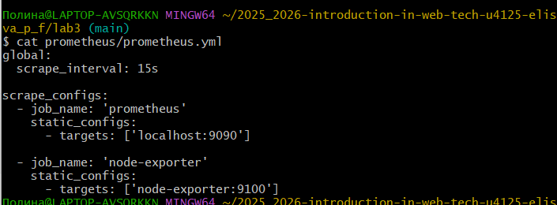
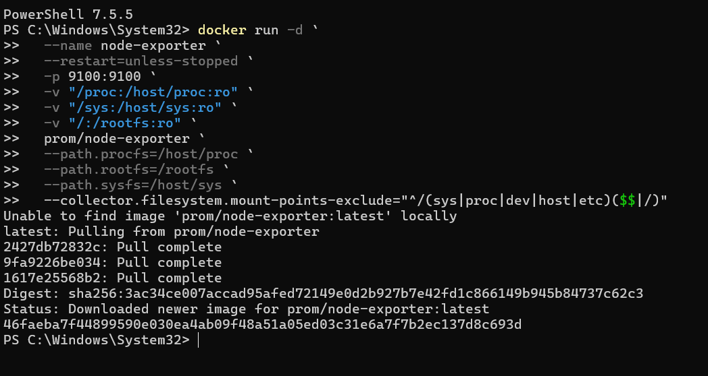
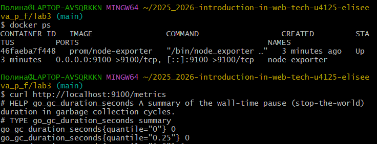

University: [ITMO University](https://itmo.ru/ru/)\
Faculty: [FICT](https://fict.itmo.ru)\
Course: [Введение в веб технологии](https://itmo-ict-faculty.github.io/introduction-in-web-tech/)\
Year: 2025/2026\
Group: U4125\
Author: Eliseeva Polina Fedorovna\
Lab: Lab3\
Date of create: 15.03.2026 \
Date of finished: 15.03.2026

# Лабораторная работа №3
## Мониторинг с Prometheus и Grafana

## Цель работы

Научиться настраивать локальную систему мониторинга, собирать метрики с помощью Prometheus и создавать дашборды в Grafana для визуализации данных.

## Ход работы
Настройка мониторинга с Prometheus и Grafana:
Создание конфигурации Prometheus:

1. Создала папку prometheus для конфигурации
2. Создала файл prometheus/prometheus.yml

Запуск Node Exporter:
4. Запустила контейнер Node Exporter для сбора системных метрик

Проверила работу

5. Запуск Prometheus

Создала том для данных Prometheus и общую сеть

6. Запуск Grafana:
Создала том для данных Grafana.
Запустила контейнер Grafana.

Проверила работу grafana

7. Настройка Grafana:
Добавила источник данных Prometheus:
Connections → Add new

Выбрать Prometheus

URL: http://prometheus:9090
Save & Test

Создала дашборд:
Create → Dashboard → Add visualization
Выбрать источник данных Prometheus
Добавить метрику: node_cpu_seconds_total
Сохранить дашборд

8. Тестирование системы:
Проверила все контейнеры: docker ps

Открыла Prometheus и убедилась, что метрики собираются

Открыла Grafana и проверила отображение графиков

Создала несколько графиков для разных метрик (CPU, память, диск)

